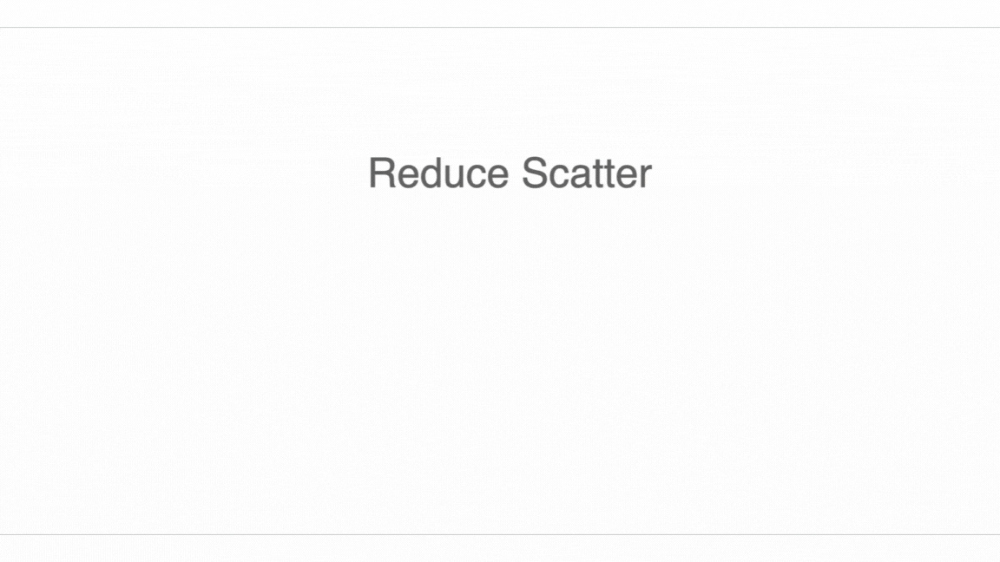

# Sharded Matrices and Device Meshes

When you train an LLM on thousands of GPUs, the abstract computation is the same as on one GPU — it's still matrix multiplications, activations, and a backward pass. The difference is that the model weights and activations don't fit in the HBM of a single GPU, so we split them across devices. We call this **sharding** or **partitioning**. The art of distributed training is figuring out how to shard so that computation stays efficient and communication doesn't become the bottleneck.

This chapter builds the mathematical framework for sharding and works through the key collective operations your GPU cluster will perform. The concepts here underpin everything in [Chapter 6](training-parallelism) (FSDP, tensor parallelism, pipeline parallelism) and [Chapter 10](inference) (KV cache sharding for inference).

## Device Meshes

We think of our GPUs as arranged in a logical **device mesh** — a multi-dimensional grid where each axis has a name. This is separate from how the GPUs are physically wired; the mesh is just a labeling of the devices that makes it easy to reason about which devices communicate with each other.

**Example:** 8 GPUs in a 2×4 mesh with axes named `X` and `Y`:

```
        Y=0   Y=1   Y=2   Y=3
X=0  [GPU 0][GPU 1][GPU 2][GPU 3]
X=1  [GPU 4][GPU 5][GPU 6][GPU 7]
```

In PyTorch, you create a device mesh with:

```python
import torch
import torch.distributed as dist
from torch.distributed.device_mesh import init_device_mesh

# Initialize distributed process group first
dist.init_process_group(backend="nccl")

# 8 GPUs in a 2x4 mesh
mesh = init_device_mesh("cuda", (2, 4), mesh_dim_names=("X", "Y"))

# Get a sub-mesh along one axis
x_mesh = mesh["X"]  # 2-GPU submesh along the X axis
y_mesh = mesh["Y"]  # 4-GPU submesh along the Y axis
```

You can also describe common training parallelism configurations with named meshes:

```python
# 64 GPUs: 8 data-parallel × 8 tensor-parallel
mesh = init_device_mesh("cuda", (8, 8), mesh_dim_names=("dp", "tp"))

# 64 GPUs: 4 pipeline × 4 TP × 4 DP
mesh = init_device_mesh("cuda", (4, 4, 4), mesh_dim_names=("pp", "tp", "dp"))
```

## Sharding Notation

We use subscript notation to describe how a tensor's dimensions are distributed across the mesh. Given a tensor `A` with logical shape `[I, J]`:

- `A[I, J]` — **fully replicated**: every device holds a complete copy
- `A[I_X, J]` — **I-axis sharded along X**: each device holds `I / |X|` rows; the J axis is replicated across Y
- `A[I_X, J_Y]` — **both axes sharded**: each device holds `(I / |X|) × (J / |Y|)` elements; total memory per device = `1/(|X|·|Y|)` of the full tensor
- `A[I_{XY}, J]` — **I-axis sharded across both X and Y flattened**: each device holds `I / (|X|·|Y|)` rows

The subscript tells you which mesh axis a tensor dimension is partitioned over. A tensor dimension without a subscript is **replicated** across that mesh axis.

![Figure: an example array A[I, J] sharded across 4 devices as A[I_X, J_Y]. Each device holds 1/4 of the total memory.](../assets/img/sharding-example.png)

**Sharding diagrams for a 2×2 mesh:**

![Fully replicated: A[I, J] — every device has the full array.](../assets/img/sharding-colored1.png)

![A[I_X, J] — first dimension sharded along X; J replicated across Y.](../assets/img/sharding-colored2.png)

![A[I_X, J_Y] — both dimensions sharded; each device holds 1/4 of the array.](../assets/img/sharding-colored3.png)

![A[I_{XY}, J] — I sharded across X and Y combined; J replicated.](../assets/img/sharding-colored5.png)

**Rule:** a tensor dimension cannot be sharded along the same mesh axis twice. `A[I_X, J_X]` is invalid — once mesh axis X is used to shard dimension I, it cannot also shard dimension J.

:::{note}
**Pop quiz:** Tensor `A` has shape `fp32[1024, 4096]` and sharding `A[I_{XY}, J]` on mesh `{X: 8, Y: 2}` (16 GPUs total). What is the local shape per GPU? How long to load from HBM on H100?

Local shape: `fp32[1024/(8×2), 4096] = fp32[64, 4096]`. Size: `4 × 64 × 4096 = 1 MB`. Load time: `1e6 / 3.35e12 ≈ 0.3 µs` (tiny — but likely latency-bound in practice).
:::

## PyTorch DTensor

PyTorch's `DTensor` (Distributed Tensor) is the native API for expressing sharded tensors. A `DTensor` has a global logical shape and a set of **placements** — one per mesh dimension — that describe how it is distributed.

```python
import torch
from torch.distributed.device_mesh import init_device_mesh
from torch.distributed.tensor import DTensor, Shard, Replicate, distribute_tensor

mesh = init_device_mesh("cuda", (2, 4), mesh_dim_names=("X", "Y"))

# Create a local tensor on each GPU
local = torch.randn(64, 128, device="cuda")

# Distribute it: shard dim-0 along X, replicate along Y
#   → global shape: [128, 128], local shape: [64, 128]
dt = distribute_tensor(local, mesh, placements=[Shard(0), Replicate()])

print(dt.shape)          # torch.Size([128, 128])  ← global shape
print(dt.to_local().shape)  # torch.Size([64, 128])   ← local shard

# Shard both dimensions
dt2 = distribute_tensor(local, mesh, placements=[Shard(0), Shard(1)])
# global shape: [128, 512], local shape: [64, 128]
```

Placements per mesh axis:
- `Shard(dim)` — shard the tensor along `dim` across this mesh axis
- `Replicate()` — replicate the full tensor across this mesh axis
- `Partial()` — each device holds a partial result (e.g., partial sum); requires a reduction to get the full value

`DTensor` automatically handles collectives when you do operations that require it. For example, a matrix multiply between two `DTensor`s with incompatible shardings will insert the necessary AllGather or ReduceScatter automatically.

```python
# Two sharded tensors
A = distribute_tensor(torch.randn(256, 512), mesh, [Shard(0), Replicate()])
B = distribute_tensor(torch.randn(512, 256), mesh, [Replicate(), Shard(1)])

# DTensor handles the sharding arithmetic automatically
C = torch.mm(A, B)  # C has sharding [Shard(0), Shard(1)]
```

## Collective Operations

When sharding changes — due to a matmul, an optimizer step, or explicit resharding — GPUs need to communicate. Four collective operations cover almost all cases.

### AllGather

**AllGather** removes a sharding: every device ends up with the full tensor. If `A` is `A[I_X, J]` on a 4-GPU ring, after AllGather each GPU holds `A[I, J]`.

```
Before:   GPU0: A[0:64]   GPU1: A[64:128]   GPU2: A[128:192]   GPU3: A[192:256]
After:    GPU0: A[0:256]  GPU1: A[0:256]    GPU2: A[0:256]     GPU3: A[0:256]
```


**Cost:** each device sends `V/N` bytes and receives `V × (N-1)/N` bytes, where `V` is the total tensor size and `N` is the number of GPUs in the ring. For large tensors in the bandwidth-bound regime:

$$T_\text{AllGather} = \frac{V}{W_\text{link}}$$

where $W_\text{link}$ is the **bidirectional** link bandwidth. Importantly, this does not depend on $N$ — adding more devices to the ring doesn't slow down a bandwidth-bound AllGather (each device just has a smaller shard to send).

### ReduceScatter

**ReduceScatter** is the inverse: it takes a replicated tensor of partial sums (one partial sum per device), sums them across devices, and gives each device a different shard of the result.

```
Before:   GPU0: A_partial   GPU1: A_partial   GPU2: A_partial   GPU3: A_partial
After:    GPU0: A[0:64]     GPU1: A[64:128]   GPU2: A[128:192]  GPU3: A[192:256]
```



**Cost:** same as AllGather — $T = V / W_\text{link}$ in the bandwidth-bound regime.

ReduceScatter is the workhorse of FSDP gradient reduction: after the backward pass, each GPU has a full-size gradient tensor with partial sums. ReduceScatter produces a sharded gradient that each GPU owns outright, at half the communication cost of a full AllReduce.

### AllReduce

**AllReduce** = ReduceScatter + AllGather. Every device gets the fully reduced tensor. Cost: `2 × V / W_link`.

AllReduce is what DDP uses for gradient synchronization. FSDP uses ReduceScatter + AllGather separately so it can overlap them with computation.

### AllToAll

**AllToAll** (also called "all-to-all" or "transpose") sends different data from each device to each other device — like a matrix transpose across the device dimension. It's used when changing which tensor dimension is sharded (e.g., in sequence parallelism, swapping from sequence-sharded to model-dimension-sharded).


**Cost:** same as AllGather in the bandwidth-bound regime — $T = V / W_\text{link}$.

### Bandwidth numbers on real hardware

For H100 SXM5 within a DGX node (NVLink 4.0, 900 GB/s bidi):

| Collective   | Bytes transferred per GPU | Time for 1 GB tensor |
|:------------ |:------------------------- |:-------------------- |
| AllGather    | $V$                       | `1e9 / 900e9 ≈ 1.1 ms` |
| ReduceScatter| $V$                       | `1.1 ms`               |
| AllReduce    | $2V$                      | `2.2 ms`               |

For cross-node InfiniBand NDR (50 GB/s per GPU):

| Collective   | Time for 1 GB tensor |
|:------------ |:-------------------- |
| AllGather    | `1e9 / 50e9 = 20 ms` |
| AllReduce    | `40 ms`              |

This 18× gap between NVLink and InfiniBand is the fundamental reason that tensor parallelism (which requires frequent AllGathers between every transformer layer) must run within a node, while data parallelism (which syncs once per step) can span nodes.

## Sharded Matrix Multiplication

Now the key question: when we multiply two sharded matrices, what communication is required?

Consider `C = A @ B` where `A` has shape `[B, D]` and `B` has shape `[D, F]`. The **contracting dimension** is `D` — the dimension being summed over. Non-contracting dimensions (`B` and `F`) appear in the output.

All cases reduce to four rules:

### Case 1: No sharded contracting dimension

When neither input is sharded along `D`, each device can multiply its local shards independently. No communication needed.

$$A[I_X, J] \cdot B[J, K_Y] \rightarrow C[I_X, K_Y]$$

This is the cheapest case. Both FSDP and tensor parallelism exploit this: weights are sharded, activations are local, and the matmul produces a sharded output without communication.

More examples:

$$\begin{align}
A[I, J] \cdot B[J, K] &\rightarrow C[I, K] \\
A[I_X, J] \cdot B[J, K] &\rightarrow C[I_X, K] \\
A[I, J] \cdot B[J, K_Y] &\rightarrow C[I, K_Y] \\
A[I_X, J] \cdot B[J, K_Y] &\rightarrow C[I_X, K_Y]
\end{align}$$

### Case 2: One input sharded along the contracting dimension

If `A` is sharded along `D` but `B` is not, each device has a partial sum. Options:

**Option A — AllGather first:** reassemble `A` on every device, then do the full local matmul.

$$\text{AllGather}_X(A[I, J_X]) \rightarrow A[I, J] \xrightarrow{\cdot B[J, K]} C[I, K]$$

Communication cost: `V_A / W_link`.

**Option B — local matmul then AllReduce:** each device computes its partial sum, then sums across devices.

$$A[I, J_X] \cdot B[J_X, K] \rightarrow C_\text{partial}[I, K] \xrightarrow{\text{AllReduce}_X} C[I, K]$$

Communication cost: `2 × V_C / W_link`.

Which is cheaper depends on whether `V_A` or `V_C` is larger. For tall-thin A and wide C, AllGather A is cheaper. This is the choice PyTorch's DTensor makes automatically.

:::{note}
**Takeaway:** when one input is sharded along the contracting dimension, you either AllGather it first (before the matmul) or do local partial matmuls and AllReduce the result. The right choice depends on tensor shapes and available bandwidth.
:::

### Case 3: Both inputs sharded along the contracting dimension

$$A[I, J_X] \cdot B[J_X, K] \rightarrow C_\text{partial}[I, K] \xrightarrow{\text{AllReduce}_X} C[I, K]$$

Each device holds partial sums over its shard of `J`. After the local matmul, AllReduce sums the partials across all devices. This is used in tensor parallelism for the MLP layers (covered in [Chapter 6](training-parallelism)).

### Case 4: Both inputs have the same non-contracting dimension sharded along the same axis

$$A[I_X, J] \cdot B[J, I_X] \rightarrow \text{???}$$

This is invalid — you can't independently multiply shards of `A` and `B` when they are both sharded along the same axis of the mesh but contribute to the same output dimension. You must AllGather one of the inputs first.

$$\text{AllGather}_X(A[I_X, J]) \rightarrow A[I, J] \xrightarrow{\cdot B[J, I_X]} C[I, I_X]$$

## The Overlap Pattern

In practice, the goal is to **overlap communication with computation** so that the GPU never waits idle for data to arrive.

The classic pattern in tensor parallelism (Megatron-style):

1. `AllGather` weights from shards → put on separate CUDA stream
2. While AllGather runs, begin the local matmul from the first shard that has arrived
3. `ReduceScatter` partial outputs → overlaps with the next layer's forward pass

```python
import torch.distributed as dist

# Non-blocking AllGather on a separate stream
comm_stream = torch.cuda.Stream()
with torch.cuda.stream(comm_stream):
    dist.all_gather_into_tensor(full_weight, local_weight, group=tp_group, async_op=True)

# Compute stream can do other work while AllGather runs
compute_output = torch.mm(activation, already_gathered_weight)

# Wait for AllGather to finish before using full_weight
torch.cuda.current_stream().wait_stream(comm_stream)
output = torch.mm(activation, full_weight)
```

## Worked Problems

**Question 1 [AllGather cost]:** In FSDP, before each layer's forward pass, the full weight matrix must be assembled from shards. A transformer layer has an attention weight matrix of shape `bf16[4096, 4096]` sharded across 8 GPUs (NVLink, 900 GB/s bidi). How long does the AllGather take?

:::{dropdown} Answer
Weight size: `4096 × 4096 × 2 bytes = 33.5 MB`.

$$T = \frac{33.5 \times 10^6}{900 \times 10^9} \approx 37 \text{ µs}$$

A single layer's weight AllGather takes about 37 µs. A 32-layer model has 32 × (attn + FFN) = ~64 weight matrices. Total AllGather time per forward pass: ~2.4 ms — fast enough to overlap completely with compute.

Now for cross-node InfiniBand (50 GB/s): `33.5e6 / 50e9 ≈ 0.67 ms` per matrix, `~43 ms` total — now it starts to compete with compute time, which is why FSDP works better within-node.
:::

**Question 2 [ReduceScatter vs AllReduce in DDP]:** DDP uses AllReduce to sync gradients; FSDP uses ReduceScatter + AllGather. For a 7B parameter model in BF16, compare the communication cost per step for 8 GPUs on NVLink.

:::{dropdown} Answer
Gradient size: `7e9 × 2 bytes = 14 GB`.

**DDP (AllReduce):** `2 × 14 / 900 ≈ 31 ms`.

**FSDP (ReduceScatter + AllGather):** `14/900 + 14/900 ≈ 31 ms`.

The total bytes are the same! FSDP's advantage is not less communication — it's that FSDP shards the optimizer state and gradients, reducing peak memory. The ReduceScatter and AllGather can also be pipelined with computation more easily than a monolithic AllReduce.
:::

**Question 3 [tensor parallelism communication]:** You shard a `bf16[8192, 8192]` weight matrix column-wise across 4 GPUs for tensor parallelism (Megatron-style). Each GPU handles a `[8192, 2048]` shard. After the local matmul, you ReduceScatter the partial activations. The forward pass on one GPU takes 1 ms. Is the communication overlappable?

:::{dropdown} Answer
Activation size (assuming batch 512 tokens): `bf16[512, 8192]` = `512 × 8192 × 2 = 8.4 MB`.

ReduceScatter time (NVLink 900 GB/s): `8.4e6 / 900e9 ≈ 9 µs`.

Local matmul time: 1 ms.

The ReduceScatter (9 µs) is well under the compute time (1 ms) — it's easily hidden. This is why tensor parallelism within a node is efficient on NVLink hardware.

If you tried to run tensor parallelism across nodes (InfiniBand, 50 GB/s): `8.4e6 / 50e9 = 168 µs` — 17% of compute time, adding ~17% overhead even with perfect overlap. In practice the overhead is worse, which is why tensor parallelism is almost always kept within a single NVLink domain.
:::

**Question 4 [sharding arithmetic]:** A 70B model has hidden dimension 8192 and MLP intermediate size 28672. The MLP consists of two linear layers: up-projection `[8192, 28672]` and down-projection `[28672, 8192]`. You tensor-parallel shard both across 8 GPUs. What is the local weight size per GPU? What collectives are needed for a forward pass?

:::{dropdown} Answer
Up-projection sharded column-wise: `[8192, 28672/8] = [8192, 3584]` per GPU.
Down-projection sharded row-wise: `[28672/8, 8192] = [3584, 8192]` per GPU.

Local weight memory: `(8192×3584 + 3584×8192) × 2 bytes = 2 × 29.4 MB = 58.8 MB` per GPU (vs 471 MB unsharded).

**Forward pass collectives:**
1. No communication needed before the up-projection (`A[I, J] · B[J, K_Y] → C[I, K_Y]` — Case 1).
2. After the activation function, each GPU has a sharded activation `[B, K_Y]`.
3. Down-projection is `A[I, K_Y] · B[K_Y, J] → C_partial[I, J]` — Case 3 (both sharded along contracting dim).
4. **AllReduce** the partial sums to get the full output `C[I, J]`.

Total forward-pass communication: one AllReduce of `bf16[B, 8192]`. At batch B=512: `512×8192×2 = 8.4 MB`, time ≈ `2×8.4/900 ≈ 18 µs` — negligible compared to compute.
:::

## Key Takeaways

- **Device meshes name your GPUs.** A 2D mesh with axes `(dp, tp)` lets you describe data parallelism and tensor parallelism separately without conflating them.

- **Sharding notation is precise.** `A[I_X, J_Y]` tells you exactly which device has which data. Contracting dimensions must be handled carefully.

- **Four collective operations cover all cases:** AllGather, ReduceScatter, AllReduce, AllToAll. All cost `V / W_link` per device in the bandwidth-bound regime, independent of the number of devices.

- **Sharded matmuls have four cases.** When neither input is sharded along the contracting dimension, no communication is needed. All other cases require at least one AllGather or AllReduce.

- **NVLink vs InfiniBand determines what parallelism is feasible.** Tensor parallelism (AllReduce every layer) requires NVLink bandwidth. Data parallelism (AllReduce once per step) can tolerate InfiniBand.

- **Overlap is everything.** Keep communication on separate CUDA streams so the compute SM is never waiting for bytes to arrive.

[^1]: The situation is actually a bit more subtle. Even if a model's weights fit on a single GPU, splitting the computation across multiple GPUs can still be beneficial: it reduces the per-step time (strong scaling) even if total memory would be fine. But the most common driver is memory — a 70B model in BF16 takes 140 GB, which doesn't fit on a single H100.
[^2]: In PyTorch, `torch.distributed.all_gather_into_tensor` performs an AllGather into a pre-allocated output tensor. The async variant (`async_op=True`) returns a handle that you wait on later, enabling overlap with compute.
[^3]: The bidirectional bandwidth of NVLink 4.0 (H100) is 900 GB/s. Each GPU has 18 NVLink lanes at 50 GB/s each. Within a DGX H100 node, NVSwitch provides non-blocking connectivity so each GPU gets the full 900 GB/s to every other GPU simultaneously.
[^4]: In a non-wrapped ring (no NVSwitch), the maximum hop count between two devices is `N/2`. In an NVSwitch domain, all devices are effectively one hop away, which is why the AllGather formula `T = V / W` holds regardless of N.
